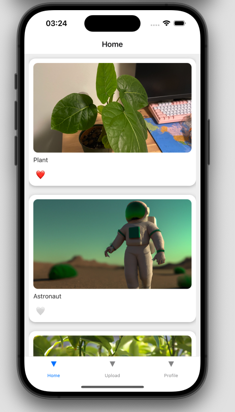
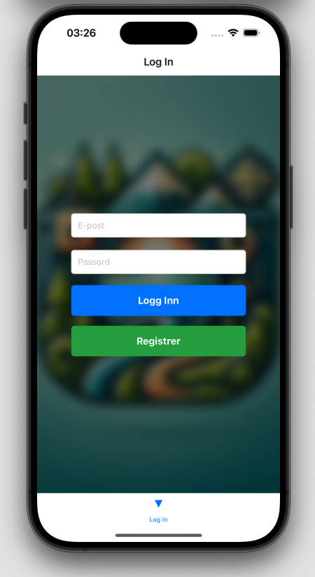

# Travelsnap-kopi

Start appen med:

```bash 
npm install
npm start
Kjør på iOS simulator
```

## Beskrivelse
TravelSnap er en app som lar deg ta bilder og legge til en beskrivelse av bildet. Bildene blir lagret i en database og kan hentes ut igjen. Appen er laget med React Native, Expo og Firebase. 

### Bilder

<p float="left">
  
  
</p>


### Funksjonalitet

Appen har følgende funksjonalitet:

- [x] Logg inn og registrer bruker
- [x] Logg ut
- [x] Last opp bilde
- [x] Vis bilder
- [x] Vis profil
- [x] Endre profil
- [x] Vis detaljvisning av bilde

### Struktur

Prosjektet er strukturert på følgende måte:


```
.
├─ .expo
│  └─ ... (Konfigurasjon av Expo)
│
├─ android
│  └─ ... (Android-spesifikk kode)
│
├─ assets 
│  └─ ... (Bilder og ikoner)
│
├─ navigation
│  ├─ BottomTabNavigator.js (Navigasjonsbar)
│  └─ StackNavigator.js (Navigasjon mellom skjermer)
│  
├─ node_modules
│  └─ ... (NPM-pakker)
│ 
├─ screens
│  ├─ AuthenticationScreen.js (Logg inn og registrer bruker)
│  ├─ DetailScreen.js (Detaljvisning av bilde)
│  ├─ HomeScreen.js (Hjem-skjerm)
│  ├─ ProfileScreen.js (Profil-skjerm)
│  └─ UploadScreen.js (Last opp bilde)
│
├─ .gitignore
├─ app.json (Konfigurasjon av appen)
├─ App.tsx (Hovedfil)
├─ babel.config.js (Konfigurasjon av Babel)
├─ FirebaseConfig.js (Konfigurasjon av Firebase)
├─ FirebaseImageService.js (Lagring av bilder i Firebase)
├─ FirebaseService.js (Lagring av data i Firebase)
├─ index.tsx (Startpunkt for appen)
├─ package-lock.json
├─ package.json
├─ README.md
└─ tsconfig.json (Konfigurasjon av TypeScript)
```